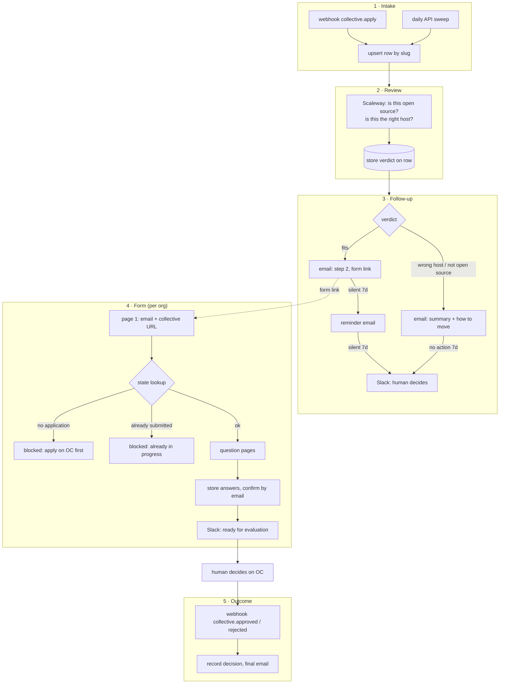

# Application automation — design

**Status:** draft, awaiting review
**Issue:** [#13 — Automate application process for new collectives](https://github.com/opensourceeurope/community/issues/13)
**Scope:** the full happy path, end to end, running against production Open Collective
with all outbound messages gated by a dry-run switch.

## Purpose

Today a project applying to be fiscally hosted by Open Source Europe (OSE) or Open
Collective Europe (OCE) goes through a partly manual chain: apply on Open Collective
(OC), receive a Typeform link, fill it in, wait for a human to notice. The steps are not
visible to the applicant, not tracked in one place, and depend on somebody remembering
to move them along.

This design replaces that with one automated pipeline that is transparent to the
applicant, gives reviewers a single view of who is waiting for what, and keeps applicant
data in Europe. It drops Typeform.

It does **not** decide who gets hosted. Approval and rejection remain human decisions
made on Open Collective — see [Human decisions](#human-decisions).

## Decisions

| Topic | Decision | Why |
|---|---|---|
| Automation engine | Self-hosted **n8n** on an OVHcloud VPS | ~$8.50/month against Typeform's ~$70; EU host; the workflow *is* the documentation |
| Entry point | **The OC application is the only promoted route.** The form link is sent by email | OC already validates the structural things (collective exists, 2+ admins, not hosted elsewhere) — no reason to rebuild that |
| Forms | **n8n-native multi-page forms**, one per org | No extra service; page-to-page branching happens in the workflow, so validation can hit real data between pages |
| State | **n8n Data tables**, on an n8n instance backed by **Postgres** | Gives reviewers a browsable list of applications in the n8n UI with nothing extra to build; the Postgres backend means one `pg_dump` covers workflows, credentials and applicant state |
| AI review | **Scaleway Generative APIs** (EU), `mistral-small-3.2-24b-instruct-2506`, via a plain HTTP Request node | Same provider, model and env-var names as `ose-knowledge-mcp`, so operational knowledge transfers and the provider stays swappable |
| Helpdesk | **The automation never writes to Freshdesk** | See [Freshdesk](#freshdesk-deliberately-untouched) |
| Reviewer surface | The n8n Data table, plus Slack when a human is needed | One list, one nudge channel |
| Decision of record | **Open Collective** | Where it already happens, and where the AI policy requires it stays |
| Outbound safety | Every email and Slack message gated by `DRY_RUN` | Production data from day one without production consequences |

## Architecture

Five independent workflows. None of them calls another. They coordinate only through
the state table, keyed by collective slug.

That isolation is the point: each workflow can be run, re-run and tested on its own; a
failure in one does not lose an application, because the row records the stage reached
and the sweep picks up anything stalled.



### 1 · Intake

Trigger: the `collective.apply` webhook, subscribed on each host account (OSE and OCE),
with a **daily API sweep** as a safety net for missed or failed deliveries.

Both paths do the same thing: **upsert the row by collective slug**. That is what makes
the webhook and the sweep safe to both fire for the same application — the second one
finds the row and changes nothing. The row records `org` (which host was applied to),
the collective's name, URL and description, and `applied_at`.

Stage after this step: `applied`.

### 2 · Review

A single HTTP Request node to Scaleway's OpenAI-compatible endpoint. One call, one
structured answer — no agent loop, no retrieval.

**What is sent:** the collective's public description and long description, the
application message, and the linked repository and website URLs.

**What is never sent:** the applicant's email address, name, or any other personal
detail. The verdict is a judgement about a *project*; there is no reason for a person's
data to reach an inference API to obtain it.

**What comes back** (`response_format: json_object`, prompt and schema versioned in
`automation/prompts/`):

```json
{
  "verdict": "fits | wrong_host | not_open_source | unclear",
  "confidence": 0.0,
  "is_open_source": true,
  "reasoning": "two or three sentences a reviewer can read",
  "applicant_message": "plain-language explanation, safe to paste into an email"
}
```

`reasoning` is for reviewers; `applicant_message` is written to be read by the
applicant, so the follow-up email never exposes raw model output framed for internal
use.

Stage after this step: `reviewed`.

### 3 · Follow-up

Branches on the verdict:

- **`fits`** → the step-2 email with the per-org form link. Stage `form_invited`.
- **`wrong_host`, `not_open_source`, `unclear`** → an email containing
  `applicant_message` plus instructions: how to move the application to the other host,
  or what is missing to qualify. The applicant can reply — the reply lands on the
  existing Freshdesk ticket, as today. Stage `advised`.

Timers, both driven by the daily sweep reading `stage` and timestamps rather than by
n8n Wait nodes, so a restart cannot lose them:

| Condition | Action |
|---|---|
| `form_invited`, no form activity for 7 days | reminder email, set `form_reminded_at` |
| `form_invited` and already reminded, silent 7 more days | Slack: human decides, stage → `escalated` |
| `advised`, no action for 7 days | Slack: human decides, stage → `escalated` |

`unclear` is deliberately routed to the human path rather than to a form invitation — an
uncertain model should produce a person's attention, not an automated decision.

### 4 · Form

One n8n-native multi-page form per org. Page 1 asks for contact email and the OC
collective URL; every later page asks application questions migrated from Typeform.

**Page 1 validation is a state lookup, nothing more:**

- no row for this slug → blocked: "apply on Open Collective first"
- row already at `form_submitted` or beyond → blocked: "already in progress; email us if
  you think this is an error"
- otherwise → continue, stage `form_started`

No other checks are needed. Applying on OC already proved the collective exists, has at
least two admins, and is not hosted elsewhere.

**Answers are persisted page by page**, not only at final submit. n8n's multi-page form
holds one open execution: if the applicant closes the tab, that execution is gone. A
write after each page means a re-entry resumes from `form_page` instead of starting over,
and a dropped execution costs one page rather than the whole application.

n8n forms carry only a `Required Field` rule — there is no regex or length validation.
So anything stricter (a plausible OC collective URL, for instance) is a **between-pages
workflow check** that routes to an error page, not a field rule.

On submit: answers stored, confirmation email to the applicant, Slack "ready for
evaluation". Stage `form_submitted` → `awaiting_decision`.

### 5 · Outcome

Trigger: the `collective.approved` and `collective.rejected` webhooks. Records the
decision and `decided_at`, and sends the applicant a closing email. Stage `approved` or
`rejected`.

## State model

One n8n Data table, `ose_applications`, keyed by `slug`. Data tables support only
Boolean, Date, Number and String, so structured values are stored as JSON strings — the
shapes live in `automation/prompts/` and `automation/docs/`.

| Column | Type | Notes |
|---|---|---|
| `slug` | String | Open Collective collective slug — the key for every workflow |
| `org` | String | `ose` or `oce` — which host was applied to |
| `collective_name` | String | |
| `collective_url` | String | |
| `stage` | String | see the stage table below |
| `applied_at` | Date | from the OC application |
| `ai_verdict` | String | `fits` / `wrong_host` / `not_open_source` / `unclear` |
| `ai_confidence` | Number | |
| `ai_reasoning` | String | for reviewers |
| `ai_applicant_message` | String | safe to send to the applicant |
| `ai_model` | String | the model id that produced the verdict |
| `ai_reviewed_at` | Date | |
| `contact_email` | String | from form page 1 — personal data |
| `form_invited_at` | Date | |
| `form_reminded_at` | Date | |
| `form_page` | Number | furthest page completed, for resume |
| `answers` | String | JSON of submitted answers |
| `form_submitted_at` | Date | |
| `slack_notified_at` | Date | |
| `decision` | String | `approved` / `rejected`, from OC |
| `decided_at` | Date | |
| `dry_run` | Boolean | true if this row was processed with outbound suppressed |
| `freshdesk_ticket_id` | String | always empty for now — reserved, see below |

### Stages

| Stage | Meaning | Set by |
|---|---|---|
| `applied` | OC application seen, row created | intake |
| `reviewed` | AI verdict stored | review |
| `form_invited` | step-2 email sent | follow-up |
| `advised` | told it looks like the wrong host, or not open source | follow-up |
| `form_started` | page 1 passed | form |
| `form_submitted` | all answers stored | form |
| `awaiting_decision` | Slack sent, waiting on a human | form |
| `approved` / `rejected` | decision recorded from OC | outcome |
| `escalated` | went quiet; a human was asked to look. Not terminal — the row resumes its normal path if the applicant acts | follow-up |

## Human decisions

The org [AI policy](https://github.com/opensourceeurope/.github/blob/main/AI-POLICY.md)
lists "casting governance votes or approvals" as human-only. This design complies by
construction, and that is worth stating explicitly rather than leaving as an accident of
implementation:

- The AI review produces an **advisory verdict**. It never approves, never rejects, and
  never closes an application.
- Approve and reject happen on Open Collective, by a person. The automation only listens
  for the result.
- A `wrong_host` or `not_open_source` verdict does **not** end an application. It changes
  the email the applicant receives and, after 7 days of no movement, asks a human to
  decide.
- `unclear` always routes to a human.

## Outbound safety: DRY_RUN

The PoC runs against production OC and production email. One environment variable,
`DRY_RUN`, gates **every** outbound message — applicant emails and Slack alike.

- `DRY_RUN=true`: the message is logged and sent to an internal address instead of the
  applicant. The row still advances, and `dry_run` is set true so the row is visibly a
  test.
- `DRY_RUN=false`: normal delivery.

Two rules that keep this trustworthy:

1. **One gate, one place.** A single sub-workflow owns all outbound sending, and every
   workflow calls it. The switch is checked once, in that sub-workflow — never copied
   into each sender, because a flag checked in seven places is a flag that is wrong in
   one of them.
2. **The AI call is not gated.** It is read-only, cheap, and its output is the thing
   under test.

## Idempotency and failure

- **Every write is an upsert on `slug`.** Replayed webhooks and the daily sweep converge
  instead of duplicating.
- **Stage transitions only move forward.** A late-arriving webhook cannot pull a row
  back to an earlier stage.
- **Timers are derived, not scheduled.** The daily sweep computes what is due from
  `stage` and timestamps, so an n8n restart cannot drop a pending reminder.
- **A failed send does not lose the application.** The row keeps its stage, and the next
  sweep retries. This means an email can be sent twice if the failure happened after
  delivery but before the row was updated — acceptable, and the alternative (losing the
  applicant silently) is worse.
- **The sweep is the backstop for everything.** If webhooks break entirely, the pipeline
  degrades to at-most-24-hours-late rather than stopping.

## Reviewer surface

The `ose_applications` Data table in the n8n UI: one row per application, stage, verdict,
timestamps. Reviewers see who is waiting and for what.

Slack fires only when a human is actually needed — form submitted and ready for
evaluation, or an application that went quiet. Not on every state change; a channel that
narrates every step gets muted, and a muted channel is worse than no channel.

## Freshdesk, deliberately untouched

Freshdesk keeps doing exactly what it does today: OC's application email creates a
ticket, and applicant replies land on it. **The automation neither reads nor writes it.**

Three reasons:

1. **The API cannot do what #13 assumed.** `GET /api/v2/search/tickets` filters only on
   `priority`, `status`, `agent_id`, `group_id`, `tag`, `type`, the date fields, and
   custom fields. Subject, description and requester email are **not** filterable, and
   the index lags writes by minutes. "Search by collective slug" does not exist. It could
   be worked around — list recent tickets, match locally, stamp a custom field — but that
   is real work for a system we may be leaving.
2. **Access is unconfirmed.** The intake mailbox is an Open Collective address; whether
   OSE holds an API key and admin rights on that helpdesk is an open question. Designing
   around an unconfirmed credential is how you get a half-built integration.
3. **It would widen the sovereignty gap.** Freshworks is a US company. Writing AI
   verdicts and applicant answers into it copies exactly the data this project is trying
   to keep in Europe.

`freshdesk_ticket_id` stays on the row, unused. If API access is confirmed and Freshdesk
stays, ticket writes become an additive change with no schema migration.

## In the repository vs in the n8n UI

Workflows are built in the n8n UI, which makes it easy for the real system and the
documented system to drift. What must live in `automation/`:

| Artifact | Path |
|---|---|
| Workflow JSON exports, one per workflow | `automation/n8n/` |
| AI prompt and verdict schema | `automation/prompts/` |
| Data table definitions and JSON column shapes | `automation/docs/` |
| Email copy | `automation/emails/` |
| `.env.example` — every variable, no values | `automation/` |
| This design | `automation/docs/design.md` |

No credentials, and no real applicant data as test fixtures — synthesise them. Exports
are refreshed when a workflow changes, in the same PR as the change.

## Verification plan

Per stage, what "working" means:

1. **Intake** — a synthetic collective applying to a test host creates exactly one row;
   replaying the webhook and running the sweep change nothing.
2. **Review** — a set of hand-picked real past applications (genuine open source,
   clearly wrong host, ambiguous) produce verdicts a human agrees with. This is the one
   step whose quality is a judgement call, so it gets judged against real examples
   before it shapes any applicant's email.
3. **Follow-up** — with `DRY_RUN=true`, the right email fires for each verdict, and
   back-dating `form_invited_at` triggers the reminder and then the escalation.
4. **Form** — page 1 blocks an unknown slug and an already-submitted slug; abandoning
   mid-form and returning resumes at `form_page`.
5. **Outcome** — approving and rejecting on OC records the decision and sends the closing
   email.

Only after 2 and 3 pass does `DRY_RUN` go false.

## To verify on the VPS

Unknowns that are cheap to test and expensive to assume:

- Whether Data table filters support date comparison, for "invited 7+ days ago". If they
  are equality-only, fetch all rows and filter in the workflow — fine at this volume.
- Execution lifetime for an open multi-page form: `EXECUTIONS_TIMEOUT` and what a restart
  does to a form in progress. This sets the ceiling on how long an applicant may take.
- Whether `mistral-small-3.2-24b-instruct-2506` on Scaleway honours
  `response_format: {"type": "json_object"}`. If not, fall back to a strict prompt plus
  parse-and-retry.
- Whether one small VPS comfortably runs n8n, Postgres and the forms together.

## Non-goals

- **Replacing Freshdesk.** Worth doing, and worth doing against real requirements — how
  many agents, portal, knowledge base, SLAs — not as a side effect of this project. No
  helpdesk is currently fiscally hosted by OSE: a scan of all 466 active collectives and
  funds under the `europe` host found no helpdesk or ticketing project, so "dogfood one
  we host" is not available today.
- **Changing what OC validates.** OC checks the structural requirements; this pipeline
  trusts it.
- **Automating the hosting decision.** Explicitly out of scope, permanently.
- **Cross-host coordination beyond advice.** If someone applies to the wrong host, they
  are told how to move. Moving it for them is a later question.
